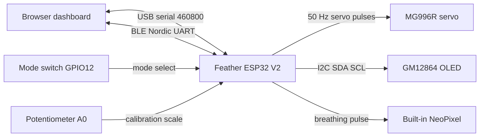

# Colloquy of Mobiles Phygital — an ESP32 pointer you drive from a browser

One servo on a stick, one ESP32, and a web page that moves it. You send a number between
`-100` and `100`; the pointer swings to that position and streams back what it did. The
number can come from a Chromium browser over a USB cable or over Bluetooth Low Energy — the
firmware treats both identically — or from a plain serial monitor.

It is a teaching rig. The point is that a design student can see the whole path from a
number in a text box to a physical arc in the room, and can watch every stage of that path
on screen while it happens.

This repository is **not** a virtual simulation, despite the folder name you may have
checked it out under. The `Colloquy-of-Mobiles-Virtual-Simulation-` prefix was inherited
from a sibling project and never described this one. On GitHub the repository is
`Colloquy-of-Mobiles-Phygital`; the flagship software system is a separate repository,
`Colloquy-of-Mobiles-Virtual-Simulation`. Nothing here talks to it.

Author: Thomas J McLeish
License: MIT

## What This System Is (and Is Not)

- It is an open-loop actuator system. It does not read servo shaft position feedback.
- It assumes servo output is proportional to command pulse timing. Nothing in the firmware
  measures whether the horn actually arrived.
- Every angle the dashboard shows you is the angle the *firmware asked for*, not a
  measurement. `a=` is a command, not a sensor reading.
- It includes a runtime guard: if commands stop arriving for 1500 ms while the mode switch
  is in command mode, the commanded position is forced back to `0.0`.
- It has no camera, no vision, no tracking code. The pan-tracking framing further down is
  the design intent that shaped the `-100..100` command format, not a shipped feature.
- It has no automated tests. `firmware/test/` contains only PlatformIO's stock placeholder
  README. Verification is the checkpoint ladder below, done by a human at the bench.

## The Numbers That Matter

Everything in this table was read out of the source named in the right-hand column. If you
change one of these, change it here too.

| What | Value | Defined in |
|---|---|---|
| Board | `adafruit_feather_esp32_v2` | both `platformio.ini` files |
| Servo | MG996R positional servo | `main.cpp`, module header |
| Servo signal pin | `GPIO13` | `SERVO_PIN` |
| **Commanded pulse range** | **500 – 2500 µs** | `SERVO_MIN_US` / `SERVO_MAX_US` |
| Neutral pulse | 1500 µs (90°) | `pulseWidthFromAngle()` |
| Angle clamp | 0° – 180° | `SERVO_MIN_ANGLE` / `SERVO_MAX_ANGLE` |
| PWM frequency | 50 Hz | `pointerServo.setPeriodHertz(50)` |
| Command range | `-100.0` to `100.0` | `COMMAND_MIN` / `COMMAND_MAX` |
| **Serial baud** | **460800** | `SERIAL_BAUD_RATE`, and `monitor_speed` in both `platformio.ini` |
| Telemetry rate | 20 Hz (every 50 ms) | `STATUS_PRINT_INTERVAL_MS` |
| Diagnostics rate | 1 Hz | the `lps=` / `perf=1` block in `loop()` |
| Command timeout guard | 1500 ms | `SERIAL_COMMAND_TIMEOUT_MS` |
| Main loop tick | 500 Hz (2000 µs floor) | `LOOP_TICK_US` |
| Firmware version string | `0.1.0` | `FIRMWARE_VERSION` |
| BLE advertising name | `Colloquy Pointer` | `BLE_DEVICE_NAME` |

### Read this before you power the servo

Two things will surprise you, and both can damage a horn or a linkage.

**1. The firmware commands a wider pulse range than the servo reference in this repository
describes.** `firmware/docs/mg996r-servo.md` records the MG996R's full-range pulse sweep as
roughly 1000 – 2000 µs across about 120° of travel. The firmware in `firmware/src/main.cpp`
commands 500 – 2500 µs across 0° – 180°. Those two statements cannot both be right about the
same part. Until somebody bench-tests the endpoints and writes the result down, treat the
extremes of travel as **unverified**: run every first motion with nothing attached to the
output shaft, and stop at the first buzz, whine or stall. A servo held against its
mechanical end stop draws stall current continuously — the same reference sheet puts that at
about 2.5 A — and gets hot.

If the reference sheet turns out to be the accurate one, the corresponding safe subset of
the command range at full pot span is about `-50` to `+50`, because
`c = -50` gives 45° and `500 + (45/180) × 2000 = 1000 µs`, and `c = +50` gives 135° and
2000 µs. That is a derivation from the pulse formula in `pulseWidthFromAngle()`, not a
measurement — but it is the sensible envelope to stay inside until somebody measures.

**2. The pointer performs a full-span sweep every single time it boots, and the calibration
knob does not restrain it.** In `setup()`, after the potentiometer filter settles, the
firmware resets the active range to the full 0° – 180° span and then runs a three-second
sweep: center → minimum → maximum → center. That happens on every power-up and every reset,
before `loop()` starts, whatever the knob is set to. Leave the horn off until you have
watched the sweep once and are satisfied with the physical range.

The knob only takes charge afterwards, once `loop()` is running.

## Hardware Overview

| Part | Detail |
|---|---|
| Controller | Adafruit Feather ESP32 V2 (`adafruit_feather_esp32_v2`) |
| Actuator | MG996R high-torque metal-gear positional servo |
| Calibration input | 3-pin potentiometer on `A0` (this board maps `A0` to GPIO26) |
| Mode input | Toggle switch on `GPIO12` to `GND`, using `INPUT_PULLUP` |
| Display (optional) | GM12864 I2C OLED, SSD1306-compatible, 128×64, address `0x3C` or `0x3D` |
| Liveness indicator | The board's built-in NeoPixel, breathing white |

The servo signal pin, `GPIO13`, is also this board's `LED_BUILTIN`. The red user LED
flickers with the servo PWM. That is expected, not a fault.

## Wiring

### Servo (MG996R)

MG996R cabling is brown/red/orange. If you are following an older sheet that says
black/red/yellow, that sheet was written for the LS-3006 this project no longer uses.

| Wire | Goes to |
|---|---|
| Brown | System `GND` — common with the ESP32 ground |
| Red | External servo supply `V+` (4.8 – 7.2 V; 5 V is the prototype default) |
| Orange | `GPIO13` (`SERVO_PIN`) |

Never power the servo from an ESP32 pin or from the 3.3 V rail.

### Potentiometer

| Pin | Goes to |
|---|---|
| Wiper (center) | `A0` |
| One outer pin | `3.3V` |
| Other outer pin | `GND` |

### Mode switch

Recommended 3-pin SPDT toggle:

| Pin | Goes to |
|---|---|
| Center / common | `GPIO12` |
| One outer pin | `GND` (this side selects oscillation mode) |
| Other outer pin | Leave unconnected |

A 2-pin switch works too: one side to `GPIO12`, the other to `GND`.

Meaning of the switch, which uses the internal pull-up:

- HIGH (open, not tied to `GND`) — command mode: the pointer follows what you send it.
- LOW (closed to `GND`) — oscillation mode: the pointer drives itself and ignores commands.

### OLED (optional)

| OLED pin | Goes to |
|---|---|
| `VCC` | `3.3V` |
| `GND` | `GND` |
| `SDA` | The board's `SDA` pin |
| `SCL` | The board's `SCL` pin |

The firmware writes `constexpr uint8_t I2C_SDA_PIN = SDA;` and `I2C_SCL_PIN = SCL` — the
symbols the board variant defines — rather than hard-coded GPIO numbers. On the Feather
ESP32 V2 those symbols resolve to GPIO22 and GPIO20, but the firmware never says so, and
that is the point: move the code to a different ESP32 board and the I2C pins follow the
board instead of following a comment somebody forgot to update. Use the pins labeled `SDA`
and `SCL` on your board and you are correct by construction.

Two board-specific notes worth knowing. First, GPIO2 on this Feather gates power to both the
NeoPixel and the STEMMA QT I2C connector — the board variant header calls it
`NEOPIXEL_I2C_POWER` — and the firmware drives it HIGH at the top of `setup()`, before it
probes for the OLED. Second, the firmware runs the I2C bus at 1 MHz (`OLED_I2C_FAST_HZ`) to
keep the partial redraw cheap, while `firmware/docs/gm12864-oled-module.md` lists the
module's supported bus speeds as 100 kHz and 400 kHz. It works on the bench module; on a
different panel, or with long jumper wires, a garbled display is the first thing to blame.

If no display answers at `0x3C` or `0x3D`, the firmware prints a line saying so and carries
on with telemetry only. A missing OLED is not an error.

## Two Transports, One Protocol

There is no longer a single serial link. USB and Bluetooth run at the same time, and
telemetry is broadcast to both.

| Transport | Browser API | Device side |
|---|---|---|
| USB serial | `navigator.serial`, opened at 460800 baud | `Serial.begin(SERIAL_BAUD_RATE)` |
| Bluetooth LE | `navigator.bluetooth`, picker filtered on the NUS service UUID | NimBLE, advertising as `Colloquy Pointer` |

BLE uses the Nordic UART Service, a long-standing convention for serial-over-Bluetooth. Two
characteristics mirror the wire exactly:

| Role | UUID |
|---|---|
| NUS service | `6E400001-B5A3-F393-E0A9-E50E24DCCA9E` |
| RX — host writes commands here | `6E400002-B5A3-F393-E0A9-E50E24DCCA9E` |
| TX — device notifies telemetry here | `6E400003-B5A3-F393-E0A9-E50E24DCCA9E` |

Why this matters in practice:

- A command that arrives over Bluetooth is fed into the same `processIncomingCharacter()`
  function as a command that arrives over USB, so parsing, clamping and the timeout guard
  behave identically. There is no second protocol to learn or to keep in sync.
- The guard is a *command* timeout, not a USB timeout. Commands from either transport
  refresh it.
- Advertising restarts automatically when a client disconnects, so you can reconnect
  without power-cycling the board.
- The dashboard's USB picker is filtered to four USB vendor IDs — `0x239a`, `0x10c4`,
  `0x1a86`, `0x0403`. A board whose USB-serial chip is not one of those four will not appear
  in the port list even though it is plugged in.
- Web Serial and Web Bluetooth both require Chromium and a secure context: `https://` or
  `http://localhost`. The dashboard checks for each API separately and tells you which of
  the two buttons is usable.

## Protocol

### Commands — host to device

One value per line, newline-terminated, clamped to `-100..100`. Parsing is strict: a line is
either a bare number, or one of four prefixes followed by a number, and nothing else.
Trailing text after the number is rejected rather than half-read, so a stray digit in a
debug string can never be mistaken for a motion command.

| Accepted | Rejected |
|---|---|
| `0`, `50`, `-25`, `+10`, `-22.5` | `move 50` |
| `cmd:37`, `cmd=37` | `37 deg` |
| `pos:-22.5`, `pos=-22.5` | `angle=90` |

Out-of-range values are clamped, not refused: `500` becomes `100.0`.

### Telemetry — device to host

Compact comma-separated `key=value` pairs, one frame per line. There are three frames.
Values that carry a decimal are printed to one decimal place.

**Status frame — 20 Hz, 12 keys.** This is the one you will watch.

```
c=-100.0,m=o,g=1,p=4095,pr=4095,a=180.0,rn=180,rx=180,sm=180.0,sx=0.0,pw=2500,lu=2000
```

That line is the widest frame the buffer has to hold, copied from the budget comment above the
`snprintf()` in `main.cpp`. It is not a capture: in real output `sm` and `sx` always bracket 90°,
because the unsnapped range is computed as center ± travel.

| Key | Field | Values / units |
|---|---|---|
| `c` | commanded position | `-100.0` .. `100.0` |
| `m` | control mode | `s` = command mode, `o` = oscillation |
| `g` | guard active | `1` = command timeout, `0` = ok |
| `p` | pot ADC, filtered | 0..4095 — box filter then EMA; this is what drives the servo |
| `pr` | pot ADC, raw | 0..4095 — unfiltered; compare with `p` to see the filter working |
| `a` | applied servo angle | degrees, `0.0` .. `180.0` |
| `rn` | active range minimum | degrees, snapped to 5° steps |
| `rx` | active range maximum | degrees, snapped to 5° steps |
| `sm` | unsnapped range minimum | degrees — debug reference from the EMA path |
| `sx` | unsnapped range maximum | degrees — debug reference from the EMA path |
| `pw` | pulse width sent to the servo | µs; 500 = 0°, 1500 = 90°, 2500 = 180° |
| `lu` | previous loop's active-work duration | µs |

**Version frame — 1 Hz, 2 keys.** Sent once a second rather than in every status frame,
because it never changes and the dashboard merges fields as they arrive.

```
lps=498,fv=0.1.0
```

| Key | Field | Values / units |
|---|---|---|
| `lps` | measured loop rate | loops per second |
| `fv` | firmware version | string, e.g. `0.1.0` |

**Performance frame — 1 Hz, 16 keys.** Worst-case durations inside the last one-second
window. Only useful when you are asking why the loop is slow.

```
perf=1,lp=2001,lpa=2000,lpm=2456,lu=310,lm=980,si=4,cm=3,ps=27,so=6,st=190,od=9800,odr=310,odx=9500,odb=1180,hb=90
```

| Key | Field | Values / units |
|---|---|---|
| `perf` | frame marker | always `1` |
| `lp` | most recent loop period | µs |
| `lpa` | mean loop period over the window | µs |
| `lpm` | worst loop period over the window | µs |
| `lu` | previous loop's active-work duration | µs (same key as in the status frame) |
| `lm` | worst loop active-work duration | µs |
| `si` | worst `processSerialInput()` | µs |
| `cm` | worst `updateControlModeAndCommand()` | µs |
| `ps` | worst `updatePotSample()` | µs |
| `so` | worst `applyServoOutput()` | µs |
| `st` | worst `printStatus()` | µs |
| `od` | worst `refreshOledStatus()` | µs |
| `odr` | worst OLED framebuffer render | µs |
| `odx` | worst OLED I2C transfer | µs |
| `odb` | most bytes pushed over I2C in one refresh | bytes |
| `hb` | worst `updateHeartbeat()` | µs |

Across all three frames the firmware emits 29 distinct keys, and the dashboard's
`TELEMETRY_KEYS` whitelist in `dashboard/app/page.tsx` accepts exactly those 29 — no more,
no fewer. That was checked key by key against the three `snprintf` format strings in
`firmware/src/main.cpp`, and it is the check to repeat whenever you add a field.

### Parsing rules

- Split a line on `,`, then split each part on `=`.
- Ignore any line that yields no `key=value` pairs — startup banners, the OLED detection
  message, the boot-sweep narration.
- Ignore keys you do not recognize rather than failing the line.
- Every value is numeric except `m`, which is a single character.
- Merge, do not replace. A frame carries only some of the 29 keys; the fields it omits are
  still valid from the last frame that carried them.

## Assembly Checkpoints (Classroom Friendly)

Use these in order. **Do not move to the next checkpoint until the current one passes.** Each
one names the evidence to capture, so that "it worked" is a thing you can show somebody
rather than a thing you remember.

### Checkpoint 1 — Power and ground sanity

1. Confirm the ESP32 powers on over USB.
2. Confirm the external servo supply is present and set to 5 V.
3. Confirm all grounds are common: ESP32 `GND` and servo supply `GND`.
4. Confirm nothing is heating.
5. Take the horn off the servo. Leave it off until Checkpoint 3 passes.

Evidence to capture:

- Photo of the full wiring from directly above.
- Short note: "Power and common ground verified, horn removed."

### Checkpoint 2 — The board is alive and talking

1. Watch the built-in NeoPixel. It breathes white on a three-second cycle. That is the
   heartbeat, and it is the fastest way to tell a running board from a locked-up one.
2. Open a serial monitor at **460800** baud. At 115200 you will get garbage characters,
   which look exactly like a broken board and are not.
3. Look for the boot lines: the OLED detection or fallback line, `Warming up pot filter...`,
   `Pot filter settled.`
4. If an OLED is connected, confirm it shows the splash and then the live status panel.

Evidence to capture:

- Screenshot of the serial monitor showing the boot lines.
- Photo of the OLED showing live values, if you have one.

### Checkpoint 3 — The boot sweep

The servo moves for the first time here, so read the safety section above first.

1. With the horn still off, reset the board.
2. Watch the output shaft: center, then minimum, then maximum, then back to center, over
   about three seconds.
3. Listen at both endpoints. A clean servo arrives and stops. A servo pressed into its end
   stop buzzes, whines or gets warm — if that happens, cut power and report it before going
   on. Do not fit the horn.
4. Only when the sweep is quiet at both ends, fit the horn and pointer at the center
   position and reset once more to confirm the arc is where you want it in the room.

Evidence to capture:

- 10-second video of one boot sweep with the horn fitted.
- Note recording whether either endpoint made a noise.

### Checkpoint 4 — Oscillation mode

1. Put the mode switch LOW.
2. Watch the pointer travel back and forth. The motion is trapezoidal, not a sine wave: it
   accelerates at a fixed rate, holds a constant speed, then decelerates into the endpoint
   and reverses. It is deliberately slow — with the firmware defaults of 5 units/s and
   5 units/s², one pass takes about 41 seconds (1 s accelerating, 39 s at speed, 1 s
   braking).
3. Confirm the telemetry shows `m=o`.

Evidence to capture:

- 10-second video clip of the oscillation motion.
- Note whether the motion appears smooth or steppy.

### Checkpoint 5 — Potentiometer range scaling

1. Stay in oscillation mode.
2. Turn the knob from one stop to the other.
3. Watch `rn=` and `rx=` in the telemetry. They move in 5° steps, not continuously — that is
   intentional quantization with hysteresis, so a noisy reading cannot flicker between two
   values.
4. Confirm the direction: knob at minimum gives the full sweep; knob at maximum collapses
   travel to the center and the pointer holds still.

Evidence to capture:

- One photo at minimum travel and one at maximum.
- The `rn` / `rx` values you read at each.

### Checkpoint 6 — Command control over USB

1. Put the mode switch HIGH. Confirm the telemetry shows `m=s`.
2. Connect the dashboard with **USB Connect**, or use a serial monitor at 460800.
3. Send `0`, `25`, `-25`, `50`, `-50`, `100`, each on its own line.
4. Confirm the pointer responds consistently and that `c=` echoes what you sent.

Evidence to capture:

- Screenshot of the dashboard or the monitor showing commands and status frames.
- Note if direction or scaling appears reversed.

### Checkpoint 7 — Command control over Bluetooth

1. Leave the mode switch HIGH.
2. Disconnect USB in the dashboard, then press **Bluetooth Connect** and pick
   `Colloquy Pointer` from the browser's picker.
3. Send the same six values.
4. Confirm the behavior is identical to Checkpoint 6. It should be: the same parser handles
   both transports.

Evidence to capture:

- Screenshot of the dashboard connected over Bluetooth showing live telemetry.

### Checkpoint 8 — The runtime guard

1. In command mode, stop sending for more than 1500 ms. In the dashboard, that means staying
   in Manual and not touching the slider.
2. Confirm the telemetry flips to `g=1` and the dashboard's guard badge reads `timeout`.
3. Confirm the pointer returns to the neutral command.
4. Send one value and confirm `g=0` returns.

Evidence to capture:

- Serial line showing `g=1`.
- Short note confirming the pointer moved back to neutral on its own.

## Photo / Demo Placeholders

Use this section as a lightweight project log. None of these files exist in the repository
yet; add them and link them here for instructor review.

1. `assets/checkpoint-1-power-ground.jpg`
2. `assets/checkpoint-2-boot-serial.png`
3. `assets/checkpoint-3-boot-sweep.mp4`
4. `assets/checkpoint-4-oscillation.mp4`
5. `assets/checkpoint-5-pot-min.jpg`
6. `assets/checkpoint-5-pot-max.jpg`
7. `assets/checkpoint-6-usb-control.png`
8. `assets/checkpoint-7-ble-control.png`
9. `assets/checkpoint-8-guard-timeout.png`

## Power and Safety

- Do not power the servo from an ESP32 pin or from the 3.3 V rail.
- Use a supply sized for stall current. The MG996R reference in this repository puts stall
  at roughly 2.5 A; a supply that sags under that will brown out the ESP32 and reset it
  mid-motion.
- Keep all grounds common.
- Expect a full-span sweep at every boot. Plan the mechanism so that sweep cannot hit
  anything.
- If the servo buzzes or strains at an endpoint, cut power. Do not "let it settle".
- The firmware commands a wider pulse range than the servo reference documents. Until that
  is resolved at the bench, treat the extremes as unproven.

## Design Context: Pan-Servo Camera Tracking

This is the problem the command format was designed for. No camera code exists in this
repository — read this as the reasoning behind `-100..100`, not as a feature.

The intended use case:

- A webcam observes a scene.
- A detected object has a known horizontal pixel position within the frame.
- The servo rotates a pointer to aim at that position in real space.

### Why commands use a normalized -100..100 range

The host knows pixel coordinates. The firmware knows servo angles. Neither side needs to
know the other's units if they agree on a normalized intermediate:

```
pixelX (0..frameWidth)
  → host normalizes to -100..100
  → firmware maps to servo angle via pot calibration
  → servo points at that horizontal position in the scene
```

This means:

- The **host** only needs to know frame width. It never deals with servo angles, pulse
  widths, or physical travel limits.
- The **firmware** only needs to know how to move the servo. It never deals with pixel math
  or camera geometry.
- The **potentiometer** is a live calibration knob: turning it narrows or widens the
  physical arc that covers the full frame, so you can match the sweep to the camera's actual
  field of view without changing code.

### Why you don't need to know the camera's FOV

If the goal is "point where the object appears in the frame", the FOV value is not required.
The pot calibration makes the correspondence implicit: adjust until the pointer tracks
correctly across the scene. The angle mapping is absorbed into the calibration rather than
computed analytically.

FOV math would only be needed for angular position in world space — "the target is 15° left
of center in the room" — which is not a goal here.

## Firmware Architecture

One module: `firmware/src/main.cpp`.

| Block | Responsibility |
|---|---|
| Input parsing | Newline-delimited commands from USB or BLE, through one shared function |
| Mode control | The hardware switch selects command mode or oscillation mode |
| Safety guard | Command timeout forces neutral in command mode |
| Calibration | Two-stage pot filter scales the usable servo span |
| Actuation | Mapped command becomes a pulse width, written only when it changes |
| Telemetry | Three frames, broadcast to serial and BLE together |
| Display | Optional OLED status panel, partial redraw only |
| Heartbeat | Built-in NeoPixel breathes to prove the loop is running |

### System diagram



### Startup flow

1. Open the serial port at 460800.
2. Power and initialize the NeoPixel.
3. Set 12-bit ADC resolution; configure the pot input and the mode switch.
4. Probe for the OLED at `0x3C`, then `0x3D`.
5. Start BLE and begin advertising as `Colloquy Pointer`.
6. Attach the servo at 50 Hz with the 500 – 2500 µs range and move to center.
7. Pump the pot filter for 500 ms — four time constants of the 125 ms EMA — so the servo
   does not chase an unsettled reading.
8. Reset the active range to the full span and run the three-second boot sweep.
9. Start at neutral, with the guard marked active until the first command arrives.

### Main loop

The loop is paced to a 500 Hz tick by an absolute-deadline spin-wait. Every subsystem checks
its own timer and returns immediately when it is not due, so no stage blocks another.

1. Wait for the next 2 ms deadline.
2. Read and parse any serial bytes.
3. Resolve the mode from the switch; in oscillation mode generate the command, in command
   mode apply the timeout guard.
4. Sample the potentiometer — every tick, so the filter gets the most data.
5. Convert the command to an angle and write the pulse width, but only if it changed.
6. Emit telemetry at 20 Hz.
7. Refresh the OLED at 4 Hz, transferring only the pixels that changed.
8. Update the heartbeat at 20 Hz.
9. Once a second, emit the version and performance frames.

The deadline scheduler keeps the phase coherent but cannot invent time: if the work in one
iteration exceeds 2 ms, `lps` drops below 500 and the performance frame shows you which
stage ate the budget.

### Why the potentiometer is filtered twice

A raw ADC read jumps around, and the BLE radio makes it worse — bursts of interference that
outlast a short averaging window. So the pot goes through two stages: a 64-sample box filter
that kills sample-to-sample jitter, then a time-based exponential moving average whose alpha
is recomputed from the real elapsed time on each call, so its 125 ms time constant holds no
matter how fast the loop is running. The result is snapped to 5° steps with 1.5° of
hysteresis before it reaches the servo, which is why `rn` / `rx` step rather than drift.
`sm` and `sx` report the unsnapped values so you can see what the filters are doing
underneath.

## Runtime Modes

**Command mode** (switch HIGH). Position comes from the host over USB or BLE. If no valid
command arrives for 1500 ms, the commanded position is forced to `0.0` and `g=1` is
reported.

**Oscillation mode** (switch LOW). Position comes from an internal trapezoidal generator —
accelerate, cruise, decelerate, reverse — which lets you validate the motion path and the
pot scaling with no host software at all. Incoming commands are still parsed, but the
generator overwrites the commanded position on every tick, and the guard is held inactive.

## Build and Run

The firmware sources live in `firmware/`, but PlatformIO can be driven from either the
repository root or from `firmware/` — see the note on the duplicated `platformio.ini` under
Repository Layout.

| Task | Command |
|---|---|
| Build | `pio run` |
| Upload | `pio run -t upload` |
| Monitor | `pio device monitor -b 460800` |
| Build one environment | `pio run --environment adafruit_feather_esp32_v2` |

If `pio` is not on your `PATH`, the root `AGENTS.md` records the full Windows path to the
PlatformIO executable.

`monitor_speed = 460800` is set in both `platformio.ini` files, so a bare
`pio device monitor` picks up the right rate on its own. The `-b` flag above is for when you
are using some other terminal program.

## Dashboard

A Next.js 14 App Router application in `dashboard/`, TypeScript, with no UI framework and no
styling library — one `globals.css` and hand-written SVG.

| Script | Command | What it does |
|---|---|---|
| `dev` | `next dev` | Development server on `http://localhost:3000` |
| `build` | `next build` | Production build |
| `start` | `next start` | Serve the production build |

There is no lint or test script. Type-check with `npx tsc --noEmit` from inside `dashboard/`.

To run it: `npm install`, then `npm run dev`, from inside `dashboard/`, in Chrome or Edge.

What the page gives you:

- **Connection** — USB Connect, Bluetooth Connect, Disconnect, and a status badge. Each
  button is disabled when its browser API is missing, with a line telling you which one.
  Failures are translated into plain advice rather than raw exception text: "Port could not
  be opened (likely in use). Close PlatformIO/terminal serial monitor first."
- **Streaming data** — mode, guard, command, angle, range and pulse width, each with a
  sparkline on fixed axes so the baseline does not wander. A "signal chain" row shows the
  whole mapping at once: command → angle → microseconds. If nothing arrives for five seconds
  while connected, a warning badge says the device may be frozen.
- **Serial history** — off by default, because keeping it on costs a render per line.
- **Performance diagnostics** — the 16 keys of the performance frame, each with a 15-second
  sparkline and both a window average and the latest value.
- **Motion profile** — Manual, or Auto at 20 Hz or 50 Hz. In Auto the dashboard runs its own
  trapezoidal generator and streams commands at that rate, with editable maximum velocity
  and acceleration and three synchronized graphs of velocity, acceleration and position,
  marked with the live phase.
- **Servo position diagram** — a dial showing the spec range, the device's active range, the
  target sub-range, the live angle and the command preview, with a target sweep and offset
  you can narrow to keep the pointer inside a chosen arc.

Note that the dashboard's Auto mode and the firmware's oscillation mode are two different
generators. The dashboard's runs on the host and sends commands; the firmware's runs on the
device and ignores them. If the switch is LOW the dashboard's Auto mode has no effect, and
the page detects that (`m=o`) and stops pushing manual commands.

### Vercel deployment

Two Vercel configurations coexist in this repository, in two different schemas, and it is
worth knowing which one is doing the work.

| File | Schema | Effect |
|---|---|---|
| `vercel.json` (root) | Legacy `version: 2`, with `builds` and `routes` | Builds `dashboard/package.json` with `@vercel/next` and rewrites `/` and everything else into `/dashboard` |
| `dashboard/vercel.json` | Modern `$schema` form | Declares `framework: nextjs` and pins the install, build and dev commands |

The root file exists so that a project whose Root Directory was left at the repository root
still builds the dashboard and still resolves `/`. The `dashboard/` file is what you want
when Root Directory is set to `dashboard`, which is the tidier arrangement. In this checkout
the linked Vercel project has no Root Directory set, so the root file is the one in force.
Switch the project to `dashboard` and the root file stops being consulted.

## Repository Layout

| Path | What it is |
|---|---|
| `firmware/src/main.cpp` | The entire firmware |
| `firmware/platformio.ini` | Canonical PlatformIO configuration |
| `firmware/docs/` | Hardware references and the student quickstart |
| `firmware/include/`, `firmware/lib/`, `firmware/test/` | PlatformIO scaffolding; stock READMEs only, no code |
| `firmware/AGENTS.md` | Firmware-specific working rules |
| `dashboard/app/` | `page.tsx` (the whole UI), `layout.tsx`, `globals.css` |
| `dashboard/types/` | Local Web Serial and Web Bluetooth type declarations |
| `dashboard/public/` | `icon.svg`, `favicon.svg` |
| `dashboard/package.json` | Scripts and dependencies |
| `dashboard/vercel.json` | Modern-schema Vercel config |
| `dashboard/README.md`, `dashboard/AGENTS.md` | Dashboard docs and working rules |
| `platformio.ini` (root) | Redirecting copy of the firmware configuration — see below |
| `vercel.json` (root) | Legacy-schema Vercel config |
| `AGENTS.md` | Shared working rules and the protocol contract |
| `LICENSE` | MIT |
| `.vscode/extensions.json` | Recommends the PlatformIO IDE extension |

### The two platformio.ini files

`platformio.ini` at the root exists because the PlatformIO VS Code extension looks for a
project file at the workspace root, and this workspace's firmware lives one level down. The
root copy adds a `[platformio]` section redirecting `src_dir`, `include_dir`, `lib_dir`,
`test_dir` and the build directories into `firmware/`, and then repeats the
`[env:adafruit_feather_esp32_v2]` block verbatim.

That duplication is real, and it is a maintenance hazard: **the `lib_deps` list, the board,
the framework and `monitor_speed` appear in both files and must be changed in both.** They
currently agree — the same five libraries at the same versions, the same board,
`monitor_speed = 460800` in each. The root file's own header comment names
`firmware/platformio.ini` as the canonical copy, so make the change there first and mirror
it up.

## Project Documents

| Document | What it covers |
|---|---|
| [`AGENTS.md`](AGENTS.md) | Shared rules, directory discipline, the telemetry contract |
| [`firmware/AGENTS.md`](firmware/AGENTS.md) | Firmware conventions, hardware reference, BLE transport |
| [`dashboard/AGENTS.md`](dashboard/AGENTS.md) | Dashboard conventions, Web Serial and Web Bluetooth guidance |
| [`firmware/docs/mg996r-servo.md`](firmware/docs/mg996r-servo.md) | The servo actually in use — electrical, mechanical and control specification |
| [`firmware/docs/gm12864-oled-module.md`](firmware/docs/gm12864-oled-module.md) | OLED module reference |
| [`firmware/docs/design-student-quickstart.md`](firmware/docs/design-student-quickstart.md) | Beginner quickstart |
| [`firmware/docs/ls-3006-servo-datasheet.md`](firmware/docs/ls-3006-servo-datasheet.md) | **Superseded.** The LS-3006 this project used before the MG996R. Kept for history; do not wire from it |
| [`dashboard/README.md`](dashboard/README.md) | Dashboard-only notes |

## Known Prototype Risks

- The commanded pulse range and the documented servo sweep disagree. Bench-test before
  trusting the endpoints.
- Open-loop control cannot detect actual shaft position error. Everything on screen is
  intent, not measurement.
- A full-span sweep happens at every boot, regardless of the calibration knob.
- Mechanical end-stop stress is possible if the range is too aggressive, and stall current is
  high enough to brown out the board.
- Electrical noise from the servo affects the ADC. That is why the pot is filtered twice;
  weak grounding will still show through.
- The protocol contract is written down in four places — this file, `AGENTS.md`,
  `dashboard/README.md` and `firmware/docs/design-student-quickstart.md` — plus the two
  implementations. `firmware/AGENTS.md` only points at the copy in `AGENTS.md`, so it does not
  need editing when a key changes. Change one of the four, change all of them.
- Two `platformio.ini` files must be kept in step by hand.

## Suggested Teaching Flow (90 Minutes)

1. 10 min — Purpose and the open-loop idea, in plain language. Why "the pointer says 90°" is
   a claim and not a measurement.
2. 15 min — Wiring, with instructor sign-off. Checkpoints 1 and 2.
3. 10 min — First power-up and the boot sweep, horn off. Checkpoint 3.
4. 15 min — Oscillation mode and knob calibration. Checkpoints 4 and 5.
5. 20 min — Drive it from the browser, first over USB and then over Bluetooth, watching the
   same telemetry both ways. Checkpoints 6 and 7.
6. 10 min — The runtime guard: stop sending, watch it recover. Checkpoint 8.
7. 10 min — Reflection notes and troubleshooting debrief.

## License

MIT. See [`LICENSE`](LICENSE).
