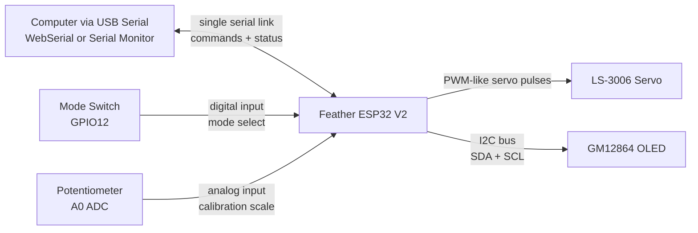

# Virtual Colloquy Direction Indicator

Prototype firmware for an ESP32-based pointer device that converts position commands from a computer into physical servo motion.

Author: Thomas J McLeish  
License: MIT

## Project Purpose
This project creates a simple physical direction indicator:
- A host app (for example WebSerial in a browser) sends position commands.
- The ESP32 maps those commands to servo movement.
- A potentiometer lets the user tune travel range in real time.
- An optional OLED shows live system status directly on-device.

The current implementation is intentionally prototype-oriented:
- fast iteration
- visible debug output
- conservative hardware limits
- reversible decisions

## Audience
This repository is designed to be understandable to design students and beginners.
You should be able to use this project as a reference even if you have limited coding or electronics experience.

## High-Level Goals
- Prove a reliable command-to-motion path.
- Verify each hardware component incrementally.
- Keep behavior observable through serial and OLED status output.
- Prevent unsafe behavior when command data disappears.

## What This System Is (and Is Not)
- It is an open-loop actuator system.
- It does not read servo shaft position feedback.
- It assumes servo output is proportional to command pulse timing.
- It includes a runtime guard that returns to neutral if serial commands stop.

## Hardware Overview
Main controller:
- Adafruit Feather ESP32 V2 (`adafruit_feather_esp32_v2`)

Actuator:
- LS-3006 (market label may read `Plastic Gear Analog Servo - 360`)
- Wire colors (Hitec-style):
- Black = GND
- Red = V+
- Yellow = Signal

Calibration input:
- 3-pin potentiometer connected to analog input (`A0`)

Mode input:
- Toggle switch connected to `GPIO12` and `GND`
- Uses `INPUT_PULLUP`

Display (optional):
- GM12864 I2C OLED (`SSD1306-compatible`, `128x64`)
- Typical address `0x3C`, alternate `0x3D`

## Key Datasheet Notes
Servo references used in this prototype:
- Neutral pulse: `1500 usec`
- Supported pulse range: `800..2200 usec` (reported)
- Current firmware starts more conservatively: `1000..2000 usec`

Important caveat:
- The LS-3006 documentation and market labeling may be inconsistent.
- Bench-test behavior before assuming positional or continuous-rotation semantics.

## Wiring
## Servo Wiring
- Servo black wire -> system GND
- Servo red wire -> external servo supply (typically 5V)
- Servo yellow wire -> `GPIO13` (`SERVO_PIN`)

## Potentiometer Wiring
- Pot center/wiper -> `A0`
- Pot side 1 -> `3.3V`
- Pot side 2 -> `GND`

## Mode Switch Wiring
- Recommended (3-pin SPDT toggle):
- Center/common pin -> `GPIO12`
- One outer pin -> `GND`
- Other outer pin -> leave unconnected

Alternate (2-pin switch):
- One side -> `GPIO12`
- One side -> `GND`

Switch meaning:
- HIGH (not connected to GND): serial control mode
- LOW (connected to GND): oscillation test mode

## OLED Wiring (Optional)
- `VCC` -> `3.3V`
- `GND` -> `GND`
- `SDA` -> board `SDA` pin
- `SCL` -> board `SCL` pin

For Feather ESP32 V2 board defaults:
- `SDA = GPIO22`
- `SCL = GPIO20`

## Assembly Checkpoints (Classroom Friendly)
Use these checkpoints in order. Do not move to the next checkpoint until the current one passes.

Checkpoint 1: Power and ground sanity
1. Confirm ESP32 powers on over USB.
2. Confirm external servo supply is present (if used).
3. Confirm all grounds are common.
4. Confirm no component is heating unexpectedly.

Evidence to capture:
- Photo of full wiring from top view.
- Short note: "Power and common ground verified."

Checkpoint 2: OLED communication
1. Boot firmware and open serial monitor at `115200`.
2. Check for OLED status message (detected or fallback).
3. If OLED is connected, verify text appears and updates.

Evidence to capture:
- Photo of OLED showing live values.
- Serial line showing OLED detection or fallback.

Checkpoint 3: Oscillation mode motion test
1. Put mode switch LOW (oscillation mode).
2. Verify pointer moves smoothly left/right.
3. Listen for strain/buzz at endpoints.
4. Stop if mechanical stress is visible/audible.

Evidence to capture:
- 10-second video clip of oscillation motion.
- Note whether motion appears smooth or jerky.

Checkpoint 4: Potentiometer range scaling
1. Stay in oscillation mode.
2. Turn potentiometer from minimum to maximum.
3. Verify travel amplitude changes clearly.

Evidence to capture:
- Note minimum visible travel and maximum visible travel.
- One image at low range and one image at high range.

Checkpoint 5: Serial command control
1. Put mode switch HIGH (serial mode).
2. Send commands: `0`, `25`, `-25`, `50`, `-50`, `100`.
3. Confirm pointer responds consistently.

Evidence to capture:
- Screenshot of serial console commands and status output.
- Note if direction or scaling appears reversed.

Checkpoint 6: Runtime safety guard
1. In serial mode, stop sending commands for > `1500 ms`.
2. Verify status reports `guard=timeout`.
3. Verify pointer returns toward neutral command.

Evidence to capture:
- Serial line showing `guard=timeout`.
- Short note confirming observed neutral behavior.

## Photo / Demo Placeholders
Use this section as a lightweight project log.

1. `assets/checkpoint-1-power-ground.jpg` (optional)
2. `assets/checkpoint-2-oled.jpg` (optional)
3. `assets/checkpoint-3-oscillation.mp4` (optional)
4. `assets/checkpoint-4-pot-min.jpg` (optional)
5. `assets/checkpoint-4-pot-max.jpg` (optional)
6. `assets/checkpoint-5-serial-control.png` (optional)
7. `assets/checkpoint-6-guard-timeout.png` (optional)

If you later add these files, link them from this section for instructor review.

## Power and Safety
- Do not power servo from ESP32 signal pins.
- Use an external servo-capable supply for motor current.
- Keep all grounds common (ESP32 GND + servo supply GND).
- If the servo buzzes or strains at endpoints, stop and reduce range.

## Firmware Architecture
The project currently uses a single main module:
- `src/main.cpp`

Functional blocks:
- Input parsing: receives newline-delimited serial commands.
- Mode control: switch selects serial mode or oscillation mode.
- Safety guard: serial timeout forces neutral command in serial mode.
- Calibration mapping: pot value scales usable servo span.
- Actuation: mapped command is sent to servo output.
- Status telemetry: serial + optional OLED display.

## System Diagram

Serial note:
- There is one physical serial connection (USB from computer to ESP32).
- Firmware receives commands and sends telemetry over that same connection.

## Control and Data Flow
Startup flow:
1. Initialize serial port (`115200`).
2. Configure analog input and mode switch.
3. Initialize OLED (if detected at `0x3C` or `0x3D`).
4. Configure servo frequency and attach output pin.
5. Start at neutral command.

Main loop flow:
1. Read serial bytes and parse complete lines.
2. Resolve active mode from hardware switch.
3. If in oscillation mode, generate synthetic command.
4. If in serial mode, apply timeout guard.
5. Read potentiometer and map command to angle.
6. Write angle to servo.
7. Print serial status at interval.
8. Refresh OLED status at interval.

## Runtime Modes
Serial mode:
- Command source: serial input from host
- Guard behavior: if no valid command for timeout period, command becomes neutral

Oscillation mode:
- Command source: internal sine wave
- Purpose: quickly validate motion path and pot scaling without host software

## Serial Protocol
Current protocol is intentionally simple:
- One command per line
- First numeric token in each line is used
- Input and output share the same serial channel

Valid examples:
- `0`
- `50`
- `-25`
- `cmd:-40`
- `pos=72.5`

Command range:
- Input is clamped to `-100..100`

## Runtime Guard
Guard purpose:
- avoid stale command control when serial stream stops

Current guard rule:
- In serial mode, if no valid command arrives for `1500 ms`, command is forced to `0.0`.

## Status Output
Serial fields include:
- `command`
- `mode`
- `guard`
- `potRaw`
- `servoAngleDeg`

OLED fields include:
- control mode
- safety guard state
- command
- potentiometer raw value
- computed angle
- OLED I2C address

## Build and Run
From project root:
- Build: `pio run`
- Upload: `pio run -t upload`
- Monitor: `pio device monitor -b 115200`

## Suggested Incremental Validation
1. Confirm board boots and prints startup text.
2. Verify OLED detection or graceful no-display fallback.
3. Test oscillation mode first using switch.
4. Turn pot and confirm motion range changes.
5. Switch to serial mode and send test values.
6. Stop sending commands and verify guard timeout behavior.

## Suggested Teaching Flow (90 Minutes)
1. 10 min: Explain system purpose and open-loop concept in plain language.
2. 15 min: Wiring check with instructor sign-off.
3. 20 min: Oscillation mode and potentiometer calibration exercise.
4. 20 min: Serial command exercise with command/response observation.
5. 10 min: Runtime guard demonstration and discussion.
6. 15 min: Reflection notes and troubleshooting debrief.

## Project Documents
- `AGENTS.md`: project coding and documentation rules
- `docs/ls-3006-servo-datasheet.md`: servo reference notes
- `docs/gm12864-oled-module.md`: OLED reference notes
- `docs/design-student-quickstart.md`: beginner quickstart

## Known Prototype Risks
- Servo model behavior may differ from listing/spec claims.
- Open-loop control cannot detect actual shaft position error.
- Mechanical end-stop stress is possible if limits are too aggressive.
- Electrical noise from servo load can affect MCU if grounding/power are weak.

## License
MIT. See `LICENSE`.
